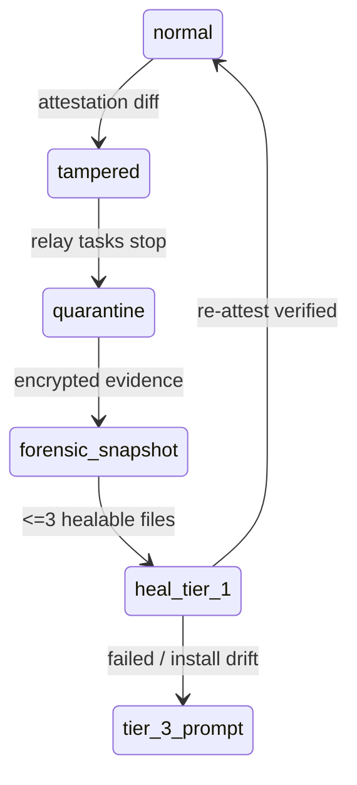

# Local Node Recovery

Recovery is cache-backed and forensic-first.



## Verified Cache

`src/release-manifest.js` caches releases under:

```text
~/.spinny-local/releases/<commit>/
  manifest.json
  files/
  verified_at
```

Only releases that passed manifest signature and file-hash verification can be
used as a healing source.

## Forensics

`src/recovery.js` writes quarantine bundles under:

```text
~/.spinny-local/quarantine/<timestamp>/
  evidence.json
  files/*.enc
```

File bodies are encrypted with a key derived from the node identity. The portal
receives metadata only.

## Never Auto-Healed

- `state.enc` / legacy `state.json`
- `.env`
- `vault.sqlite`
- `security.jsonl`
- identity keys
- quarantine bundles

Tier 3/Tier 4 reinstall or factory reset must remain user-confirmed.
